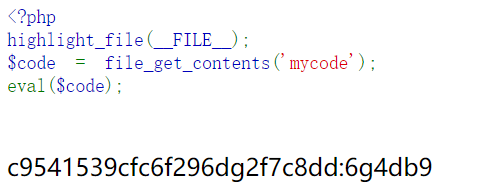
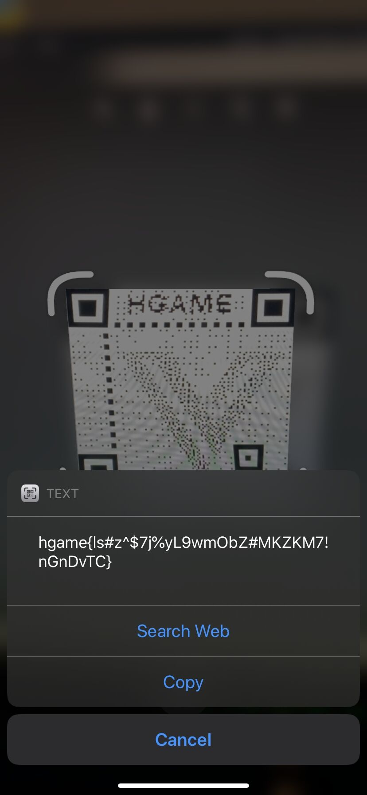
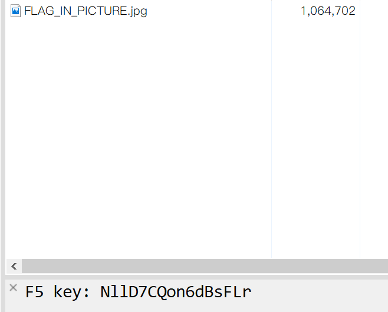

## Web

### Cosmos的新语言

首先给了段源码



然后代码审计发现包含了一个"mycode"文件，于是改一下URL


发现是一段加密代码，将flag加密了，根据前面的代码可以知道需要对那段字符串解密得到`token`，然后post回去才能拿到flag

一开始想的是手动解码，但是后来发现这段加密代码一直在不断的变化，解出来的token也在不断变化，大约5秒左右变化一次，于是想到用Python拆解加密代码然后进行分析，直接得到解密步骤，拿到`token`再直接post过去。exp代码如下

```python
import requests
import base64
import string
def decrypt(token):
    result = ""
    for x in token:
        result += chr(ord(x)-1)
    return result
def strrev(token):
    return token[::-1]
def b64decode(token):
    return base64.b64decode(token.encode()).decode()
def rot13(token):
    result = ""
    for x in token:
        if x in string.ascii_lowercase:
            result += chr(((ord(x)-ord('a')+13)%26)+ord('a'))
        elif x in string.ascii_uppercase:
            result += chr(((ord(x)-ord('A')+13)%26)+ord('A'))
        else:
            result += x
    return result
url = "http://33cb992b0c.php.hgame.n3ko.co/"
php = "http://33cb992b0c.php.hgame.n3ko.co/mycode"
r = requests.get(url)
code = requests.get(php)
token = r.text[625:-21]
en = code.text[164:-75]
de = en.split('(')
de.pop()
for step in de:
    if step == "encrypt":
        token = decrypt(token)
    elif step == "base64_encode":
        token = b64decode(token)
    elif step == "str_rot13":
        token = rot13(token)
    elif step == "strrev":
        token = strrev(token)
flag = requests.post(url, data={"token":token})
print(flag.text)
```

最后拿到flag


---

## Misc

### Cosmos的午餐

拿到的是一个pacpng文件和一个ssl通信的log文件，于是可以知道是HTTPS流量分析

首先用wireshark打开，导入log得到明文通信内容，然后追踪流发现一个压缩包文件，里面有个`Outguess with key.jpg`，可以知道是outguess隐写，于是在网上找了相应的解密工具，得到隐写内容是一个url，下载后是一个压缩包，里面有张二维码，扫描拿到flag



---

### 所见即所假

拿到的是一个压缩包，里面有张图片



提示F5 key，于是得知是F5隐写，在网上找了对应的工具，用key解密得到一串hex

在线转字符串拿到flag


---

### 地球上最后的夜晚

拿到一个加密的压缩包和一个pdf


于是猜想是`wbStego`隐写，试了下果然得到了压缩包密码


解压后是一个doc，里面是篇小说，没有找到隐藏文字，于是把这个文件解压， 搜索字符串`hgame`，拿到flag


---

## Crypto

### 签到题

直接给了一段Python代码，分析了一下发现有两个关键的函数


看起来需要找到所给字符串的前四位，用了sha256算法，然后输入`I like playing Hgame`即可

打开`hashcat`，先用Python连接上打开交互模式，拿到sha256密文和残缺的明文，然后构造一个掩码字符集，用`hashcat`进行sha256掩码攻击

```shell
>hashcat64 -a 3 --force -c abcdefghijklmnopqrstuvwxyzABCDEFGHIJKLMNOPQRSTUVWXYZ0123456789 -m 1400 cbd0841aed15ae0ae263b7a1863046b1880e6f6290033a234e96814b325c0c10 !c!c!c!cIO7mztG5K9Xn3fUo
```

得到前四位`nmCz`


拿到flag